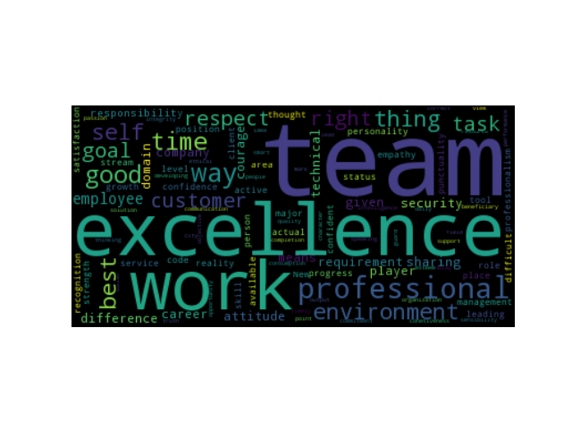

### Text Analysing Application using
### Natural Language Processing(NLP)

---
## What is this application about ?
+++
* Surveys consists of large amount of text
* Time consuming to read all the text and come to a conclusion
* This application gives better intution over data in less time
* Uses azure and google NLP cloud services
---
## What this application can do ?
+++
### Generates Word Cloud from text

this is an image generated from answers about question
What is professional excellence ?

+++
### Generates Pie charts illustrating sentiment of data

---
### What this application uses in azure services ?
* Uses azure *sentiment analysis*(piechart)
* Uses azure key word detection for *extracting keywords*(word cloud)
* Uses azure *topic detection* for generating topic of each sentence (word cloud)
  * keys generated avoids noise in image
* also uses WUP similarity for generating Word-Cloud related to keywords in question​
+++
WC generated from topics | WC generated from keys
-------------------------|------------------------
|

+++

WC generated from keywords related to question

+++
### But !!!
* topic detection *takes 7 to 8 minutes* for returning result
* Some part of request does not support asynchronous requests

* Extracting keywords related to question take 6 to 7 seconds of compilation

---
### What this application uses in google cloud services ?
* Uses google *sentiment analysis*
* Uses google *syntax analysis*
  * Returns every word saperately tagged with
    * parts of speech (tag,mood,tense etc.)
    * dependency edge of syntax tree
    * lemma of each word
* Google NLP service als have *entity analysis* which extracts *common nouns* from text
+++

### WC generated from google cloud data

---
### Asynchronous nature of code
* (best ans most intresting part of application)
* First I sent http request to REST services **one by one**
  * as a result it **took 30 seconds** for each time compile and run
* Used libraries **asyncio,aiohttp** and some features of python3 *yield from*
* When i made it **asynchronous** it took **less than 3 seconds** for compile and run

+++
### Not only this !!!
* as the code is written in python
  * It have good scope for furthur development
  * Pythom has largest support for natural language processing libraries (Spacy,NLTK etc)
  * Very easy to use on integrating this application with google docs or microsoft online excel sheets

---
# Design of Application
+++
